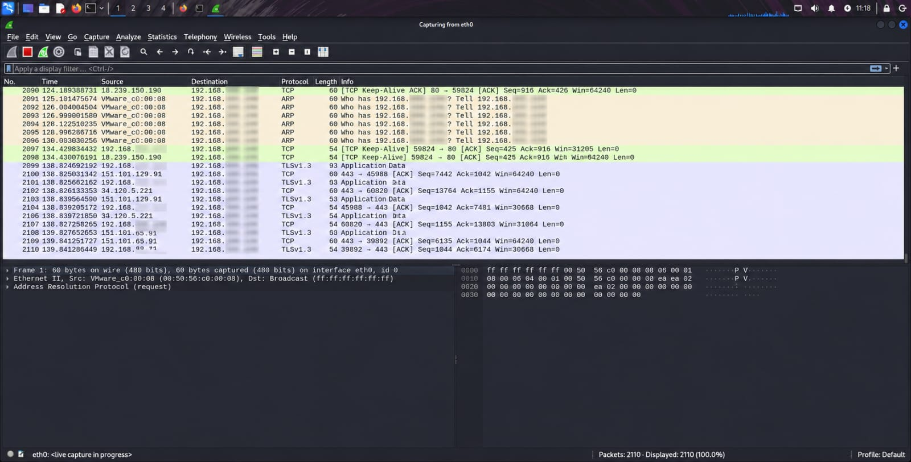
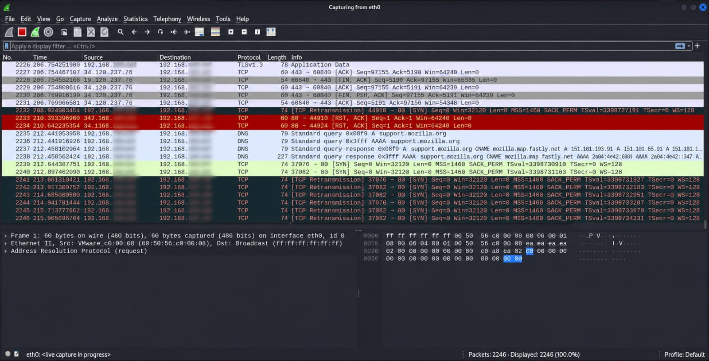
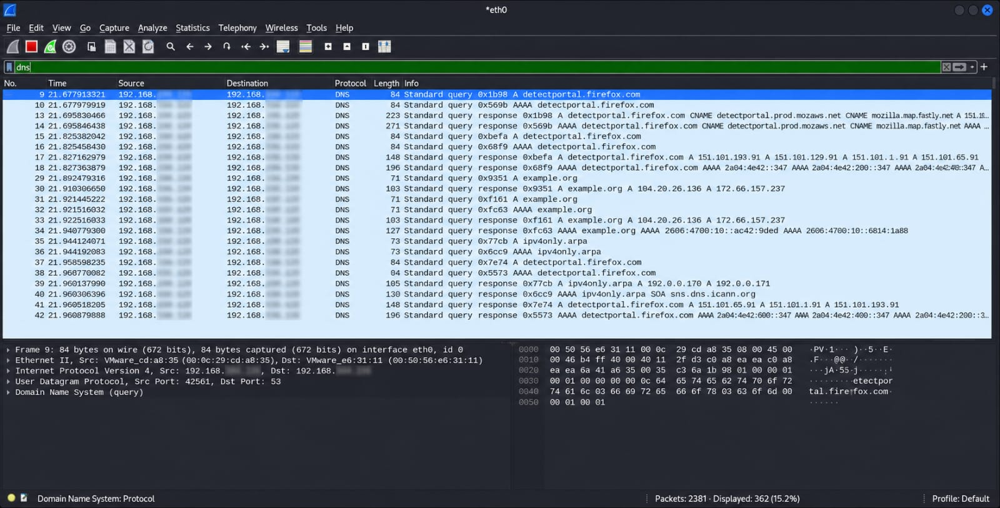
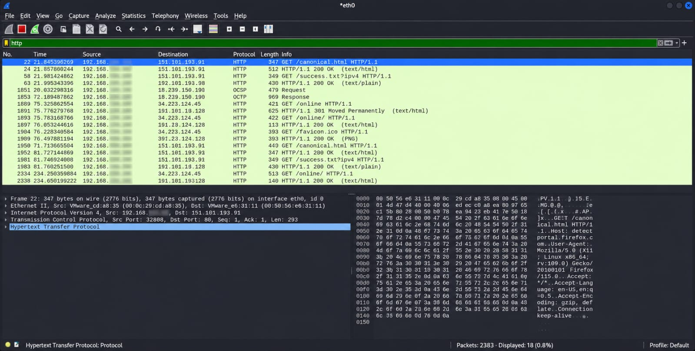
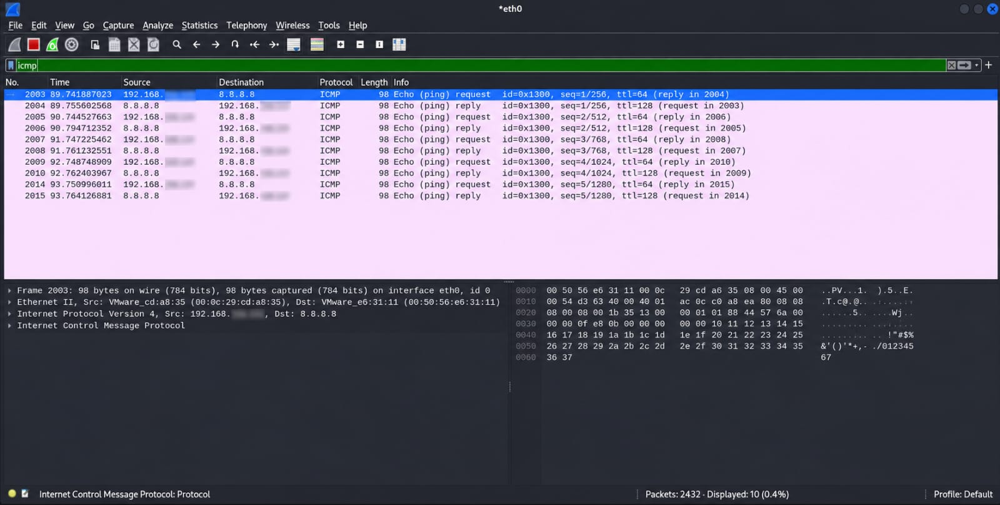
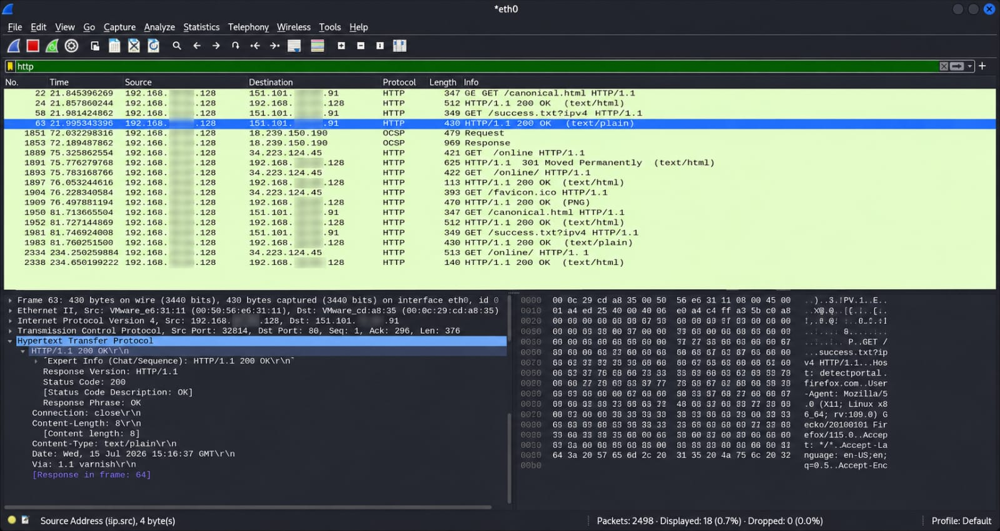

# Wireshark Network Traffic Analysis

## Project Overview
This project demonstrates basic network traffic analysis using Wireshark. The objective is to capture and analyze network packets to understand common protocols such as DNS, HTTP, and ICMP.

## Objectives
- Capture live network traffic
- Analyze DNS queries
- Analyze HTTP traffic
- Analyze ICMP packets (Ping)
- Examine packet details and protocol information

## Tools Used
- Kali Linux
- Wireshark 4.2.5

## Environment
- Operating System: Kali Linux
- Network: VMware Virtual Network
- Analyzer: Wireshark

## Methodology
1. Launch Wireshark.
2. Select the active network interface.
3. Start packet capture.
4. Generate network traffic by browsing websites and sending ping requests.
5. Stop packet capture.
6. Apply protocol filters.
7. Analyze captured packets.

## Filters Used
- dns
- http
- icmp

## Evidence
- Interface Selection

- Live Packet Capture

- DNS Filter Results

- HTTP Filter Results

- ICMP Filter Results

- Packet Details

## Key Findings
- Successfully captured live network traffic.
- Identified DNS queries and responses.
- Observed HTTP communication.
- Analyzed ICMP Echo Request and Echo Reply packets.
- Examined packet headers and protocol details.

## Skills Demonstrated
- Network Traffic Analysis
- Packet Inspection
- Protocol Analysis
- Wireshark
- Network Troubleshooting

## Conclusion
This project demonstrates the use of Wireshark for monitoring and analyzing network traffic. It provides practical experience in identifying common network protocols and understanding packet-level communication.

## Author
Chandranil Sawant.
